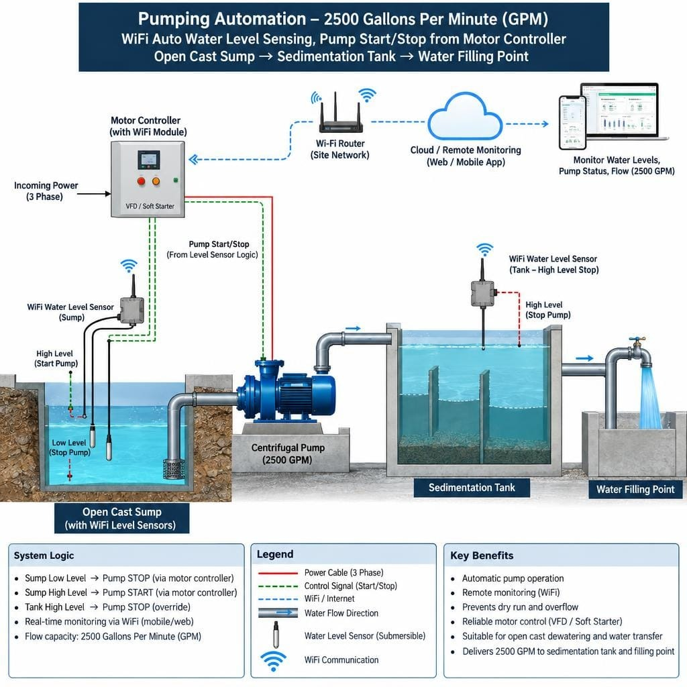
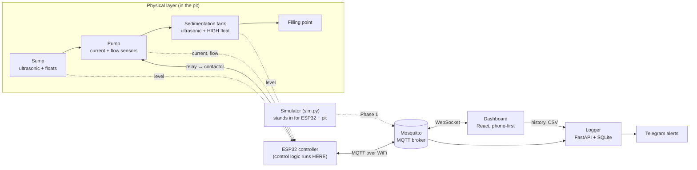
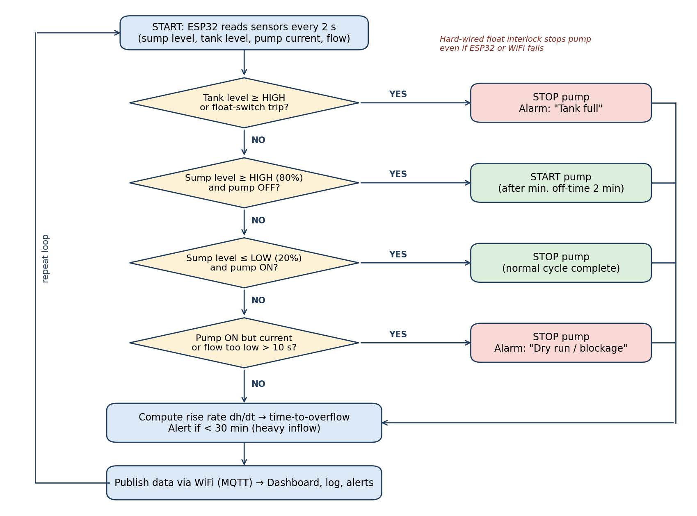
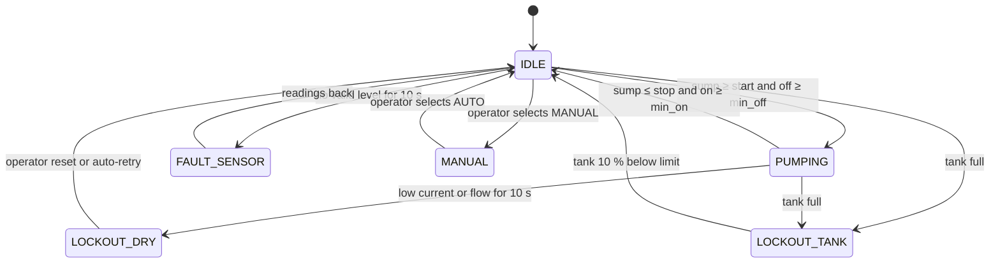
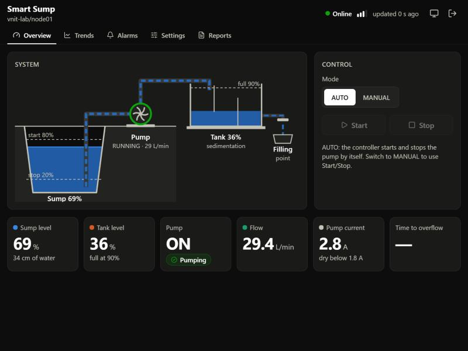
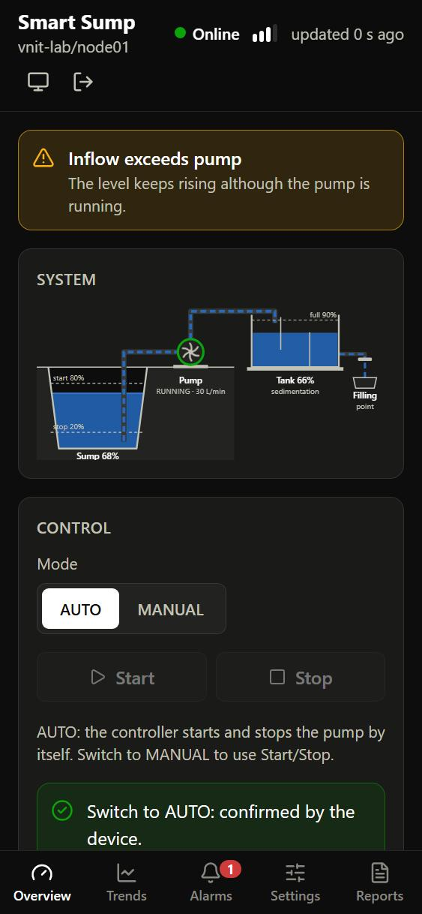
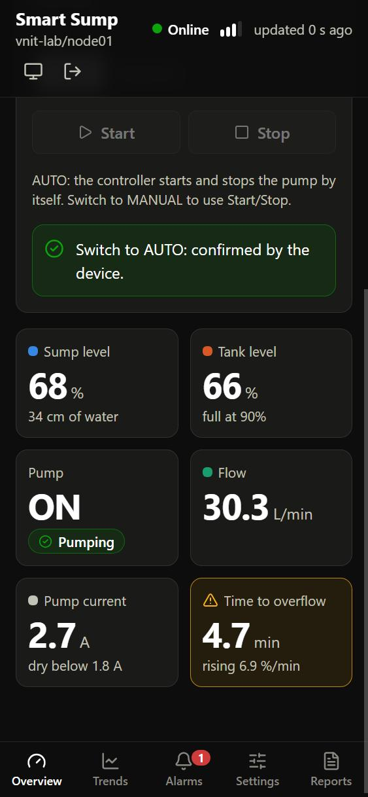
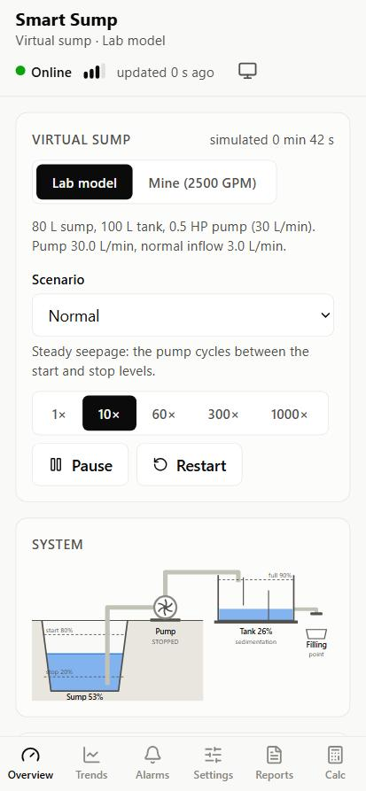
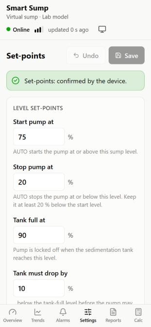

# Smart Sump

**Mine dewatering without the guesswork.** Smart Sump is a low-cost IoT controller that watches the water level in an opencast-mine sump and switches the dewatering pump on and off by itself. It protects the pump, prevents overflow, and logs every litre pumped.

| | |
|---|---|
| **Programme** | TEXMiN UG Fellowship 2026, VNIT Nagpur |
| **Student** | Golsar Keshav Kalyanrao, B.Tech Mining Engineering |
| **Mentor** | Dr. Nikhil Ninad Sirdesai, Assistant Professor |
| **Domain** | Monitoring and Tracking Technologies for Mines |
| **Timeline / budget** | 24 weeks, about ₹12,500 (lab prototype) |



> 📱 **Try it on your phone:** the **Smart Sump Virtual** Android app runs the whole system, a simulated sump plus the real control logic, offline on the phone. It includes a sump calculator. See [Phone app](#-phone-app-the-virtual-sump).

---

## 1. The problem

Rain and groundwater collect in a **sump** at the lowest point of an opencast pit. A large centrifugal pump (target: **2500 US GPM ≈ 570 m³/h, ≈133 kW**) lifts it to a **sedimentation tank** and then to a **water filling point**. Today a worker checks the level by eye and switches the pump by hand. This causes several problems:

- **Dry running.** The pump is stopped too late, so the impeller and seals are damaged and energy is wasted.
- **Overflow.** The sump or tank spills, the working bench floods, and muddy water is discharged.
- **No records.** Nobody knows the pump hours, the volume pumped, or the energy used.
- **No warning.** Nothing alerts the crew when a storm fills the sump quickly.
- **Moving sump.** The sump moves as the pit advances, so fixed wired systems get left behind.

> About **18 %** of an opencast coal mine's energy goes to pumping, and pumping energy per tonne rose **34 %** as the pit deepened (Sahoo, Bandyopadhyay & Banerjee, *J. Cleaner Production*, 2014). DGMS pre-monsoon guidance expects a sump to hold **2–3 h of peak inflow**.

## 2. The solution: sense, decide, switch the pump

1. **Level sensing.** A waterproof ultrasonic sensor (JSN-SR04T) measures the sump and the sedimentation tank. Float switches act as a backup.
2. **Automatic start/stop.** An ESP32 drives the existing starter or VFD through an opto-isolated relay and contactor.
3. **Protection.** The pump stops on dry run, blockage, or a full sedimentation tank.
4. **Phone dashboard.** It shows live level, pump status, flow, current and alarms over WiFi (MQTT).
5. **Early warning.** It predicts the **minutes left before the sump overflows** and sends a Telegram alert.

### Fail-safe first
The control logic runs **on the ESP32 itself**, so the pump stays safe even if WiFi, the internet or the server goes down. The cloud only *watches* and *asks*; it never decides safety. A hard-wired float switch in the stop circuit is the last line of defence, and it works even if the controller fails.

## 3. How it works



| Layer | What lives there |
|---|---|
| Physical | Sump, pump, tank, filling point. Level, current, flow and (optional) turbidity sensors |
| Edge | ESP32 runs the start/stop logic and the safety interlocks locally |
| Network | Site WiFi + MQTT. LoRa for sumps out of WiFi range (Phase 3 note) |
| Server | Mosquitto broker, logger (history, CSV, Telegram alerts), dashboard |
| Operator | AUTO / MANUAL, set-points, alarm acknowledge, dry-run reset |

### Control logic (identical in simulator and firmware)

<p align="center"></p>

The controller checks these rules every 0.5 s, in priority order:

| # | Rule | Effect |
|---|---|---|
| 1 | **Tank full**: tank ≥ `tank_high_pct` or tank HIGH float | Pump OFF, `LOCKOUT_TANK`, alarm `TANK_FULL`. Clears 10 % below the threshold |
| 2 | **Sensor fault**: no valid ultrasonic reading for 10 s | Floats only, `FAULT_SENSOR`, alarm `SENSOR_FAULT` |
| 3 | **Dry run / blockage**: pump ON but current or flow low for > 10 s | Pump OFF, `LOCKOUT_DRY`, alarm `DRY_RUN`. Clears on operator reset or auto-retry after 10 min |
| 4 | **Start** (AUTO): sump ≥ 80 % and pump off ≥ `min_off_time_s` | Pump ON, `PUMPING` |
| 5 | **Stop** (AUTO): sump ≤ 20 % and pump on ≥ `min_on_time_s` | Pump OFF, `IDLE` |
| 6 | **Backup floats**: sump HIGH float forces start, sump LOW float forces stop | Rules 1 and 3 still win |
| 7 | **MANUAL**: operator starts/stops from the dashboard | Rules 1 and 3 still apply |

The wide 80 % / 20 % band plus the minimum on and off times are the **hysteresis** that stops the pump chattering on and off.

**Time-to-overflow:** a straight line is fitted to the last 3 min of sump level, giving rise rate *r* in %/min. If *r* > 0, then `tto = (100 − level) / r` minutes. Alarm `OVERFLOW_RISK` is raised when `tto < overflow_warn_min`. Alarm `INFLOW_EXCEEDS_PUMP` is raised when the level keeps rising while the pump is ON.



### MQTT contract

Base topic: `smartsump/<site_id>/<device_id>/`, for example `smartsump/vnit-lab/node01/`.

| Topic | Direction | QoS | Payload (JSON) |
|---|---|---|---|
| `telemetry` | device → server, every 2 s | 0 | `{"ts", "sump_pct", "sump_cm", "tank_pct", "pump_on", "current_a", "flow_lpm", "turbidity_ntu", "rate_pct_per_min", "tto_min", "mode", "state", "alarms", "rssi"}` |
| `event` | device → server | 1 | `{"ts", "type", "code", "reason", "severity"}` |
| `status` | device → server (retained, Last Will) | 1 | `"online"` / `"offline"` |
| `config/state` | device → server (retained) | 1 | current set-points |
| `cmd/mode` | dashboard → device | 1 | `{"mode": "AUTO" \| "MANUAL"}` |
| `cmd/pump` | dashboard → device | 1 | `{"action": "start" \| "stop"}` (MANUAL only) |
| `cmd/reset` | dashboard → device | 1 | `{"alarm": "DRY_RUN"}` |
| `cmd/config` | dashboard → device | 1 | partial set-points, validated on the device |

Event `type` is one of `PUMP_START`, `PUMP_STOP`, `ALARM`, `ALARM_CLEAR`, `MODE_CHANGE`, `STATE_CHANGE`, `CONFIG_CHANGE` or `CMD_REJECTED`.

## 4. Repository layout

```
smart-sump/
├── README.md              # this file
├── config/site.yaml       # every size-specific number (tank depth, set-points, tariff…)
├── simulator/             # Python stand-in for the ESP32 + pit (Phase 1)
│   ├── control.py         #   THE control logic: pure, tested, mirrored in firmware
│   ├── physics.py         #   water balance: sump, pump, tank, filling point
│   ├── scenarios.py       #   normal / heavy_rain / dry_run / tank_full / wifi_drop / sensor_fault
│   ├── sim.py             #   runs it all, publishes over MQTT, obeys dashboard commands
│   └── tests/             #   pytest: every control rule + hysteresis
├── logger/                # MQTT → SQLite, REST API, CSV export, reports, Telegram alerts
│   ├── ingest.py          #   subscribes to every device and stores what it says
│   ├── main.py            #   the REST API (FastAPI): history, events, reports, CSV
│   ├── reports.py         #   daily pump hours, m³, cycles, kWh, ₹
│   ├── alerts.py          #   Telegram (skipped quietly if no token)
│   └── tests/
├── dashboard/             # React + Vite + TypeScript + Tailwind, phone-first
│   └── src/
│       ├── components/SystemDiagram.tsx  # animated SVG: sump → pump → tank → filling point
│       ├── lib/sump.tsx   #   MQTT over WebSocket: live state of every device
│       ├── lib/command.ts #   send a command, then wait for the device to confirm or refuse
│       └── pages/         #   Overview, Trends, Alarms, Settings, Reports
├── tools/dev_broker.py    # MQTT broker in Python, for laptops without Docker
├── mosquitto/             # broker config; password file built from .env at start-up
├── docker-compose.yml     # one command starts broker, logger, dashboard
└── firmware/              # PlatformIO ESP32 project                   (Phase 2)
```

### The dashboard

<p align="center">
  
  
  
</p>

Screenshots from the simulator's `heavy_rain` scenario. Operators sign in with the site's MQTT login. **Overview** shows the live system and big readouts, with AUTO/MANUAL and Start/Stop; every action asks for confirmation and waits for the device to confirm it. **Trends** has level, flow and current over 1 h / 24 h / 7 d, with the set-points drawn in and pump-running periods shaded. **Alarms** lists active alarms and the history, with acknowledge and dry-run reset. **Settings** edits the set-points, checked here and again on the device. **Reports** shows daily pump hours, m³, starts, kWh and ₹, with CSV download and print. Light, dark and phone layouts are all supported.

### 📱 Phone app: the virtual sump

<p align="center">
  
  
</p>

An Android app (APK, about 330 KB) that needs **no hardware, no internet and no permissions**. It is the same dashboard with a virtual sump built in:

- **Virtual sump:** pick the **Lab model** (80 L sump, 0.5 HP pump) or the **Mine** (40 × 30 × 4 m sump, 2500 GPM pump, 133 kW). Choose a scenario (normal, heavy rain, dry run, tank full, WiFi drop, sensor fault, or your own inflow on a slider) and a speed from 1× to 1000×. Then watch the controller start and stop the pump, trip the interlocks and raise alarms. Every page works: Trends, Alarms, Settings and Reports.
- **Sump calculator:** enter the sump size, pump GPM, motor kW and inflows. You get volume, fill and pump-down times, pump starts, daily pumping hours, energy (kWh) and cost (₹), the **DGMS check** (does the sump hold 2–3 h of peak storm inflow?) and how long until overflow in a storm. **"Simulate this sump"** then runs your numbers in the virtual sump.
- **Same brain as the real device:** the app's simulator is a TypeScript copy of `simulator/`. `python tools/crosscheck.py` runs both on every scenario and checks they produce the same events at the same times. They do: 97 events across 6 scenarios.

**Install:** copy `SmartSump-Virtual.apk` to the phone (WhatsApp, Drive, USB), tap it, and allow "Install unknown apps" when Android asks. Android 8.0 or newer.

**Build it yourself:**
```powershell
cd D:\sump\dashboard
npm run build:apk                # packs the dashboard + simulator into android\app\src\main\assets\index.html
cd ..\android
.\gradlew assembleRelease        # needs the Android SDK (ANDROID_HOME) and a JDK
# result: android\app\build\outputs\apk\release\app-release.apk
```

## 5. Progress

**Phase 1: simulator + MQTT + dashboard (no hardware needed)**
- [x] Git repo, project description, site config
- [x] Control logic (`simulator/control.py`) with pytest for every rule (33 tests passing)
- [x] Water-balance physics + 6 scenarios + offline simulator run
- [x] Simulator publishes over MQTT and obeys dashboard commands (Last Will, event queue during WiFi loss)
- [x] Dev broker for laptops without Docker (`tools/dev_broker.py`: same ports, same login)
- [x] Logger: SQLite history, REST API, CSV export, daily report, Telegram alerts (9 tests)
- [x] Dashboard: live overview (animated SVG), trends, alarms, settings, reports (tested in the browser against the simulator)
- [x] Mosquitto config + `docker-compose.yml` for broker + logger + dashboard ⚠️ *written, not yet run: Docker isn't installed on the dev laptop yet*
- [ ] Telegram alert tested with a real bot token

**Extra: phone app.**
- [x] Virtual-sump Android APK with a sump calculator, cross-checked against the Python simulator

**Phase 2: ESP32 firmware.** PlatformIO, the same `control.cpp` state machine, MQTT, NVS set-points.

**Phase 3: extras.** Energy (kWh, ₹), a daily report page, and a LoRa note.

## 6. Getting started (Windows)

> ⚠️ **Free up space on C: first.** Python, Node and Docker all write temp and cache files to C:, even when the project is on D:. Aim for at least 15 GB free before installing Docker Desktop.

### Python (simulator + tests)
Python 3.10 or newer from [python.org](https://www.python.org/downloads/). Tick **"Add python.exe to PATH"** during install.

```powershell
cd D:\sump
python -m venv .venv                     # a private Python just for this project
.venv\Scripts\activate                   # your prompt now starts with (.venv)
pip install -r requirements-dev.txt      # simulator + logger + dev broker + test tools
copy .env.example .env                   # then edit .env: set your own MQTT password
```

### Run the tests
```powershell
python -m pytest
```
You should see every test pass, ending in a line like `42 passed`.

### Node.js (dashboard)
Install the **LTS** version from [nodejs.org](https://nodejs.org/), then build the dashboard once:

```powershell
cd D:\sump\dashboard
npm install          # downloads React, MQTT.js, Recharts... into node_modules (~170 MB)
npm run build        # makes dashboard\dist, which the logger serves
```

> If C: is full, npm fails with `ENOSPC` even though the project is on D:. Move npm's cache first: `npm config set cache D:\dev\npm-cache`.

### Run the whole system without Docker
Open three terminals in `D:\sump` (each with `.venv\Scripts\activate`):

```powershell
python tools\dev_broker.py                                 # 1. MQTT broker (ports 1883 + 9001)
python -m logger                                           # 2. logger + dashboard on http://localhost:8000
python simulator\sim.py --scenario heavy_rain --speed 10   # 3. the "pit"
```

Open **http://localhost:8000** and sign in with the MQTT login from `.env` (user `smartsump`). Within a minute you'll see the pump start at 80 %, then the inflow and overflow alarms as the storm beats the pump. The API docs are at http://localhost:8000/docs. To get alarms on your phone, put a Telegram bot token and chat id in `.env`.

**On your phone** (same WiFi as the PC): start the broker with `python tools\dev_broker.py --lan` and the logger with `python -m logger --host 0.0.0.0`, find the PC's address with `ipconfig` (e.g. `192.168.1.20`), and open `http://192.168.1.20:8000` on the phone. Allow Python through Windows Firewall when asked (private networks only).

**Changing the dashboard code?** Run `npm run dev` in `dashboard\` instead and open http://localhost:5173. It reloads as you edit and forwards `/api` to the logger.

### Run with Docker (the brief's one-command setup)
1. Free at least 15 GB on C:, then install [Docker Desktop for Windows](https://www.docker.com/products/docker-desktop/) and accept the WSL 2 option during setup. Restart when asked.
2. In `D:\sump`: `copy .env.example .env` and set your own `MQTT_PASSWORD`.
3. Start everything:
   ```powershell
   docker compose up --build
   ```
4. Open **http://localhost:8080**, and run the simulator from your venv as before: `python simulator\sim.py --scenario heavy_rain`.

Stop with Ctrl+C. Data and retained messages survive restarts in Docker volumes. *(Not tested yet on this laptop: see the progress list above.)*

### Run the simulator on its own (no broker needed)
```powershell
python simulator\sim.py --scenario normal --no-mqtt --speed 0 --duration 2400
python simulator\sim.py --scenario heavy_rain --no-mqtt --speed 20
```
`--speed 20` runs 20× faster than real time, and `--speed 0` runs as fast as possible. `--duration` is in simulated seconds, and Ctrl+C stops a run. The simulator prints every event (pump start/stop, alarms) and a status line every 30 simulated seconds, then a summary.

| Scenario | What happens in the "pit" | What the controller should do |
|---|---|---|
| `normal` | Steady seepage (3 L/min) | Cycles: start at 80 %, stop at 20 %, no alarms |
| `heavy_rain` | Inflow ramps to 36 L/min, more than the 30 L/min pump | `INFLOW_EXCEEDS_PUMP`, then `OVERFLOW_RISK`; pump runs flat out |
| `dry_run` | Suction strainer choked for 15 min | `DRY_RUN` after 10 s, auto-retry every 10 min, recovers once cleared |
| `tank_full` | Tank outlet closed for 20 min | `TANK_FULL` lockout until the tank drains 10 % below the limit |
| `wifi_drop` | WiFi lost for 60 s while the pump is due to start | Pump still starts on time; queued events are sent on reconnect |
| `sensor_fault` | Sump ultrasonic dead for 12 min | `SENSOR_FAULT`, `FAULT_SENSOR` state, floats take over |

*(PlatformIO setup for the ESP32 will be added in Phase 2.)*

## 7. Design decisions

1. **One control module, no I/O inside.** `control.py` never reads the clock, sleeps or touches MQTT. The caller passes in the time and the readings. Because of that, every rule can be tested in milliseconds, and the C++ copy is a line-by-line mirror.
2. **Only `step()` switches the pump.** Dashboard commands only change *requests*. Every pump decision goes through the same safety checks.
3. **Restart delay after boot.** Boot counts as "pump just stopped", so after a power blip the pump waits `min_off_time_s` before restarting. This stops a flickering supply from hammering the contactor.
4. **Floats are emergency backups.** The HIGH float forces a start and the LOW float forces a stop, ignoring the min on/off timers. If both are tripped, which is impossible unless a float has failed, the pump stops.
5. **MANUAL is bumpless.** Switching to MANUAL keeps the pump doing what it was doing. If an interlock trips in MANUAL, the start request is cancelled, so the pump never restarts by surprise.
6. **Only `DRY_RUN` can be reset by hand.** The other alarms clear themselves when the condition goes away.
7. **The trend restarts when the pump switches.** The rise rate before and after a pump start belong to two different situations, so mixing them would make the fit meaningless. Until 1 min of new data exists, `tto_min` is `null`, and an active overflow alarm is **kept**, because "unknown" is not "safe".
8. **Lab numbers are in `config/site.yaml`.** The 80 L sump, 100 L tank and 30 L/min pump are starting guesses. Replace them with measured values. `overflow_warn_min` is 3 min for the lab instead of 30 min for the mine, because small tanks fill about 100× faster.
9. **Ultrasonic pings must agree.** Each burst of 5 pings is median-filtered, *and* at least 3 pings must lie within 2 cm of each other. The simulator found that a burst with one missing ping and two wild echoes produced a bogus "tank empty" reading, which released the tank-full lockout.
10. **A sump at ≥ 98 % counts as overflowing.** A spilling sump can't rise any further, so its trend goes flat. The overflow alarm is held on until the level drops below 95 %. Without this the alarm flickered (another simulator find).
11. **Commands are queued, then applied between control cycles.** The MQTT library runs in its own thread. If commands touched the controller directly, two threads could change it at once. Instead they wait in a queue, and the control loop picks them up.
12. **The device checks every incoming topic itself.** The dev broker was caught delivering a retained `status` message to the `cmd/#` subscription. The firmware will not trust the broker to filter for it either.
13. **Events survive a WiFi drop; telemetry does not.** Events are queued (up to 100) and sent on reconnect with their original time. Old telemetry is worthless once a fresh reading exists, so it is dropped.
14. **Acknowledging an alarm is a logbook entry, not a reset.** "Ack" is stored by the logger. Only the device can clear an alarm, and only `DRY_RUN` accepts a reset command.
15. **The logger fixes 1970 timestamps.** An ESP32 that hasn't synced its clock yet reports dates in 1970. The logger replaces any time before 2020 with the time it received the message.
16. **The dashboard signs in with the MQTT login.** The password is typed by the operator, not built into the web page, so a copied page doesn't carry a working login.
17. **"Sent" is not "done".** After every command the dashboard waits for the device to confirm it. The change has to show up in telemetry or `config/state`. Otherwise it shows the device's `CMD_REJECTED` reason, or "no answer in 10 s".
18. **Charts follow a few rules.** Each measured quantity has one colour everywhere (sump blue, tank orange, flow green-blue, current violet), and the palette was checked for colour-blind safety in light and dark mode. Red, amber and green are kept for status, always with an icon and a word. There are no two-axis charts: flow and current get one chart each.
19. **Charts load only when opened.** The charting library is about half the code, so Trends and Reports load on demand. The Overview opens quickly on a phone over weak mine WiFi.
20. **The phone app reuses the dashboard instead of being a second app.** A build flag swaps the MQTT connection for a simulator running inside the page. The whole page is packed into one HTML file inside a minimal Android WebView, so there is one UI to maintain, and the app works offline with no permissions. The TypeScript copy of the control logic is kept honest by `tools/crosscheck.py`.
21. **React dashboard instead of Node-RED.** The proposal deck mentioned Node-RED. A React dashboard is easier to make mobile-first and to show to the panel.
22. **Project lives on D:\sump.** The C: drive was full.
